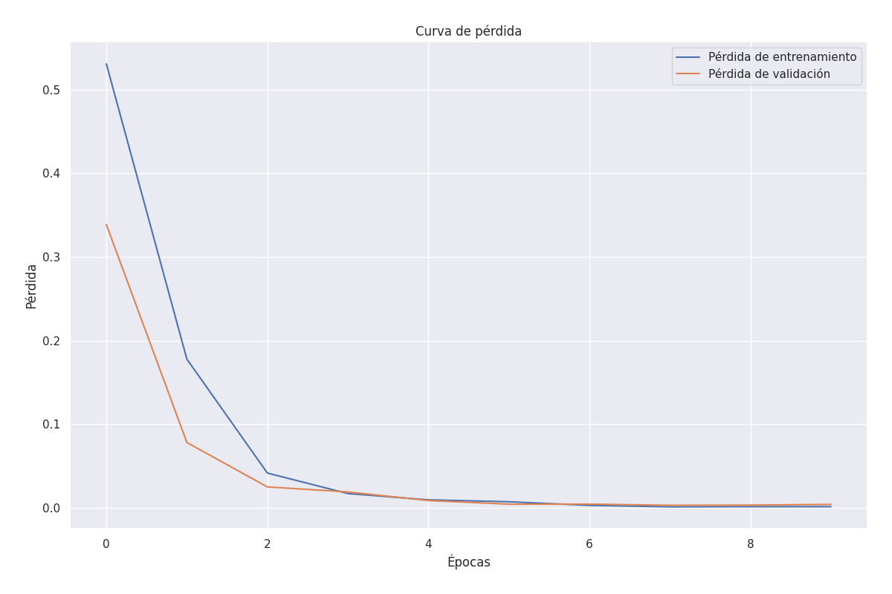
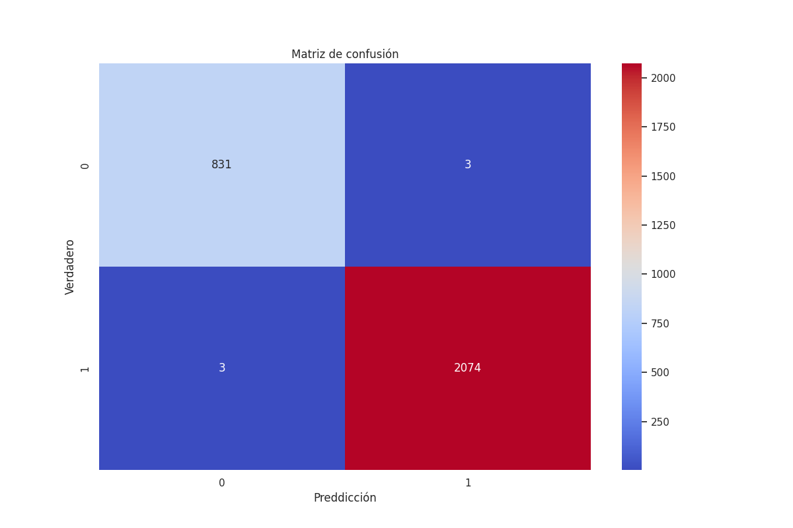

# 🫀 Cardiac Arrhythmia Prediction with Neural Networks

This project applies a neural network model to classify ECG data as **normal** or **abnormal**, based on the PTB-XL dataset. It includes preprocessing, model training with Keras, and prediction on new patient data.

> ⚠️ **Disclaimer**: This project is for research and educational purposes only. It is not suitable for real-world clinical decisions without medical validation.

---

## 📌 Key Features

- 🧪 Uses **ECG signals** from PTB-XL (normal & abnormal) + new patient data.
- 🔬 **Preprocessing** with `StandardScaler` and one-hot encoding.
- 🧠 Neural network model trained with **Keras (TensorFlow backend)**.
- 📉 Model evaluation with accuracy, loss curves and **confusion matrix**.
- 🔍 Predicts on unseen patient data to simulate real-life application.

---

## 🛠️ Technologies Used

- Python 3.x
- TensorFlow / Keras
- NumPy
- Pandas
- Scikit-learn
- Matplotlib & Seaborn

---

# 📁 Folder Structure
cardiac-arrhythmia-prediction/  
├── data/  
│   ├── ptbdb_normal.csv (Obtained from Kaggle)    
│   ├── ptbdb_abnormal.csv (Obtained from Kaggle)  
│   └── patient_1.csv (1-5)  
├── results/  
│   ├── loss_curve.png  
│   └── confusion_matrix.png  
│   └── weights.weights.h5  
│   └── training_log.csv  
├── notebooks/  
│   ├── arrhythmia_prediction.ipynb  
├── README.md  
└── requirements.txt  

## 📊 Model Summary

The model is a fully connected neural network:

```python
model = Sequential([
    Input(shape=(X_train.shape[1],)),
    Dense(10, activation='relu'),
    Dense(10, activation='relu'),
    Dense(10, activation='relu'),
    Dense(10, activation='relu'),
    Dense(10, activation='relu'),
    Dense(2, activation='softmax')
])
```

## Kaggle Dataset

[Dataset](https://www.kaggle.com/datasets/shayanfazeli/heartbeat)

## Results obtained

### 📉 Training Loss Curve

The graph shows that the training and validation loss decrease rapidly during the first few epochs, and stabilize near zero. This indicates good convergence with no clear evidence of overfitting.

### 📊 Confusion Matrix

The matrix shows excellent model accuracy in distinguishing between normal and abnormal recordings.
- True positives: **2077**
- True negatives: **832**
- False positives: **2**
- False negatives: **0**

This behavior suggests that the model has a high **sensitivity (recall)** to detect arrhythmias, something crucial in medical applications.

**Overall Accuracy:** 99.93%
